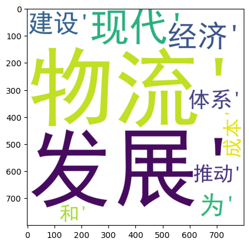

# 第三章 中文分词技术

# 分词的概念

在汉语中，词以字为基本单位，但是文章的语义表达确是以词进行划分的，对中文文本中的句子转化到词的过程就是分词，通过计算机自动识别出句子的词并且使用符号加以划分

# 分词技术

## 规则分词

规则分词的本质是通过匹配句子中的每个字符串与词典中的词，若存在则进行切分，反之不进行切分，按照切分的方式进行分类，可分为以下三个类别

### 正向最大匹配法

算法思路

1、对于需要分词的句子Sentence，从左到右取m个字符作为切分字段，m为词典中最大的字符串长度

2、对于该字段在字典中进行查词匹配，若匹配成功，则将该字段作为一个词切分出来，若匹配不成功，则将该字段最末尾的一个字去掉，将剩下的字段作为新的字段重复“2”操作，直到切分完所有词

```python
Dic=['江','南京','市长','长江','大桥','南京市','南京市长']#规则词典
Sentence="南京市长江大桥"#待分词句子
Maximum_Mach_Method=[]#存放正向最大法结果

Max_len=len(max(Dic,key=len,default=''))#词典中最大字符串长度
Length=len(Sentence)#待分词句子长度

while Length>1:
    Divide_sent=Sentence[0:Max_len]
    while Divide_sent not in Dic :
        if(len(Divide_sent)==1):
            break
        Divide_sent=Divide_sent[0:len(Divide_sent)-1]
  
    Maximum_Mach_Method.append(Divide_sent)
    Sentence=Sentence[len(Divide_sent):]
    Length=len(Sentence)
print("分词结果为：",Maximum_Mach_Method)

#分词结果为： ['南京市长', '江', '大桥']
```

### 逆向最大匹配法

中文的偏正结构影响，造成逆向最大匹配算法的误差比正向最大匹配算法要少

> [偏正短语 - 维基百科，自由的百科全书 (shenyinjise.icu)](http://shenyinjise.icu/wiki/%E5%81%8F%E6%AD%A3%E7%9F%AD%E8%AA%9E)
>
> 偏正短语由一个“偏”的修饰成分和一个“正”的受修饰成分组成，其中受修饰成分称为**中心语**。中心语前面的修饰成分，对中心语作出描写或限定。偏正短语的功能相当于后面的中心语，而不是前面的修饰成分，因此前面成分属“偏”，后面成分属“正”。例如“遥远的东方”指的是“东方”而不是“遥远”，“遥远”只是用来形容“东方”的距离；“快乐地跳”是一个动作（跳），而不是一种情态（快乐）；“很好”是“好”的意思，其程度由“很”表达出来。

```python
Dic=['江','南京','市长','长江','大桥','南京市','南京市长','长江大桥']#规则词典
Sentence="南京市长江大桥"#待分词句子
Reverse_Maximum_Mach_Method=[]#存放正向最大法结果

Max_len=len(max(Dic,key=len,default=''))#词典中最大字符串长度
Length=len(Sentence)#待分词句子长度

while Length>1:
    Divide_sent=Sentence[-Max_len:]
    while Divide_sent not in Dic :
        if(len(Divide_sent)==1):
            break
        Divide_sent=Divide_sent[1:]
  
    Reverse_Maximum_Mach_Method.append(Divide_sent)
    Sentence=Sentence[:len(Sentence)-len(Divide_sent)]
    Length=len(Sentence)
print("分词结果为：",Reverse_Maximum_Mach_Method[::-1])

#分词结果为： ['南京市', '长江大桥']
```

### 双向最大匹配法

双向最大匹配算法实际上是将正向最大匹配算法与逆向最大匹配算法得到的结果进行比较，选择词数切分最少的作为结果

```python
Dic=['江','南京','市长','长江','大桥','南京市','南京市长','长江大桥']#规则词典
Sentence="南京市长江大桥"#待分词句子

def MM(Dic,Sentence):
    Maximum_Mach_Method=[]#存放正向最大法结果
    Max_len=len(max(Dic,key=len,default=''))#词典中最大字符串长度
    Length=len(Sentence)#待分词句子长度

    while Length>1:
        Divide_sent=Sentence[0:Max_len]
        while Divide_sent not in Dic :
            if(len(Divide_sent)==1):
                break
            Divide_sent=Divide_sent[0:len(Divide_sent)-1]
      
        Maximum_Mach_Method.append(Divide_sent)
        Sentence=Sentence[len(Divide_sent):]
        Length=len(Sentence)

def RMM(Dic,Sentence):
    Reverse_Maximum_Mach_Method=[]#存放正向最大法结果
    Max_len=len(max(Dic,key=len,default=''))#词典中最大字符串长度
    Length=len(Sentence)#待分词句子长度

    while Length>1:
        Divide_sent=Sentence[-Max_len:]
        while Divide_sent not in Dic :
            if(len(Divide_sent)==1):
                break
            Divide_sent=Divide_sent[1:]
      
        Reverse_Maximum_Mach_Method.append(Divide_sent)
        Sentence=Sentence[:len(Sentence)-len(Divide_sent)]
        Length=len(Sentence)

def Compare(Maximum_Mach_Method,Reverse_Maximum_Mach_Method):
    final=[]
    final = Maximum_Mach_Method if len(Maximum_Mach_Method) > len(Reverse_Maximum_Mach_Method[::-1]) else Reverse_Maximum_Mach_Method[::-1]
    return final

MM(Dic,Sentence)
RMM(Dic,Sentence)
final=Compare(Maximum_Mach_Method,Reverse_Maximum_Mach_Method)
print("分词结果为：",final)

#分词结果为： ['南京市', '长江大桥']
```

## 统计分词

统计分词方法核心思想是通过统计的方法，通过统计相连字在文本中出现的频率来估计相连的字组成词的概率，当组合的概率（频度）高于某一个临界值得时候，便认为改组合很有可能会构成一个词语

### 语言模型

由朴素贝叶斯公式与链式法则可知

$$
P(\omega_{1},\omega_{2},\omega_{3}...\omega_{m})=P(\omega_{1})P(\omega_{2}|\omega_{1})P(\omega_{3}|\omega_{1},\omega_{2})...P(\omega_{i}|\omega_{1},\omega_{2},\omega_{3},...,\omega_{i-1})...P(\omega_{m},\omega_{1},\omega_{2},\omega_{3},...,\omega_{m-1})
$$

当文本过长得时候，公式非常难计算，故有人提出n元模型，即忽略大于等于n的上文词的影响，仅关注n个以内的上文词对于当前状态的影响

$$
P(\omega_{i}|\omega_{1},\omega_{2},\omega_{3}...\omega_{i-1})≈P(\omega_{i}|\omega_{i-(n-1)},..\omega_{i-1})
$$

#### 一元模型

当n=1的时候，将模型叫做“1元模型”，此时整个句子的概率表示为各个词语的概率的乘积，也就是每个词相互独立（注意区分相互独立与不相关的概念），此情况下句子的词序信息完全损失

> **语序**（英语：word order）是一种[文法](http://shenyinjise.icu/wiki/%E6%96%87%E6%B3%95 "文法")上的词汇的顺序，任何语言都有主词、受词、动词之分，因此就出现了语序和语法格的问题，多数的语言都有一种主要的语序，如[汉语](http://shenyinjise.icu/wiki/%E6%BC%A2%E8%AA%9E "汉语")、[英语](http://shenyinjise.icu/wiki/%E8%8B%B1%E8%AA%9E "英语")等，但是有时不只有一种，像[德语](http://shenyinjise.icu/wiki/%E5%BE%B7%E8%AA%9E "德语")、[荷兰语](http://shenyinjise.icu/wiki/%E8%8D%B7%E8%98%AD%E8%AA%9E "荷兰语")等语言有次要的语序，另一方面，有些语言由于[格变化](http://shenyinjise.icu/wiki/%E6%A0%BC_(%E8%AF%AD%E6%B3%95)) "格 (语法)")相当地清楚因而语序相当地自由，像[排湾语](http://shenyinjise.icu/wiki/%E6%8E%92%E7%81%A3%E8%AA%9E "排湾语")、[拉丁语](http://shenyinjise.icu/wiki/%E6%8B%89%E4%B8%81%E8%AA%9E "拉丁语")、[芬兰语](http://shenyinjise.icu/wiki/%E8%8A%AC%E8%98%AD%E8%AA%9E "芬兰语")等，[德语](http://shenyinjise.icu/wiki/%E5%BE%B7%E8%AA%9E "德语")在相当程度上也是如此，不过[德语](http://shenyinjise.icu/wiki/%E5%BE%B7%E8%AA%9E "德语")的语序并非完全地自由，动词不能任意变换位置（主句第一个动词（包括助动词）固定在第二位，主句第二个动词（包括助动词）之后的动词（包括助动词）及子句的所有动词放在最后），且德语除了阳性单数以外，其余状况的主宾格同形。许多语言同时具备格变化和特定的语序。[维基百科]

#### n元模型

当n=2的时候叫做二元模型，n=3的时候叫做三元模型，n=2的时候

$$
P(\omega_{i}|\omega_{1},\omega_{2},\omega_{3}...\omega_{i-1})=P(\omega_{i}|\omega_{i-1)})
$$

n越大，保留的次序信息越丰富，单计算成本也越高，在长文本中，估算n元条件概率的时候有可能会出现分母为零值的情况，需要进行平滑操作

$$
P(\omega_{i}|\omega_{1},\omega_{2},\omega_{3}...\omega_{i-1})=\frac{count(\omega_{i-(n-1)},...\omega_{i})}{count(\omega_{i-(n-1)},...\omega_{i-1}))}
$$

### HMM隐马尔可夫模型

#### HMM概念

首先规定，一个词最多只有四种构词位置（词尾）：B（词首），M（词中），E（词尾），S（单独成词），隐马尔可夫模型就是通过将分词作为在字符串中的序列标注任务实现的，然后使用数学工具将其抽象化

$$
max=maxP( o _{1}o_{2}...o_{n}|\lambda _{1}\lambda_{2}...\lambda _{n})
$$

$\lambda=\lambda _{1}\lambda _{2}...\lambda_{n}$代表输入的句子，n为句子的长度，$\lambda _{i}$代表字如["中","文","。"]，$o=o _{1}o_{2}...o_{n}$代表输出的标签如[B,M,E,S]，对于该抽象化模型，引入观测独立性假设，即每个字的输出仅仅与当前字有关，而与之前的字无关，得到

$$
P( o _{1}o_{2}...o_{n}|\lambda _{1}\lambda_{2}...\lambda _{n})=P(o_{1}|\lambda_{1})P(o_{2}|\lambda_{2})...P(o_{n}|\lambda_{n})
$$

观察模型可发现，该模型存在不合理的地方，不考虑上下文会导致出现不合理的标注情况如BBB，BEM，BSB等，为了解决这种情况，引入HMM模型，对于上述公式，$P( o _{1}o_{2}...o_{n}|\lambda _{1}\lambda_{2}...\lambda _{n})=P(o_{1}|\lambda_{1})P(o_{2}|\lambda_{2})...P(o_{n}|\lambda_{n})$，$P(o|\lambda)$是我们希望求解的，通过贝叶斯公式可知

$$
P(o|\lambda)=\frac{P(o,\lambda)}{P(\lambda)}=\frac{P(\lambda|o)P(o)}{P(\lambda)}\Longleftrightarrow P(\lambda|o)P(o)\sim P(\lambda_{1}|o_{1})P(o_{2}|o_{1})P(\lambda_{2}|o_{2})P(o_{3}|o_{2})...P(o_{n}|o_{n-1})
$$

注：对于$P(\lambda|o)P(o)$做马尔可夫假设，得到$P(\lambda|o)=P(\lambda_{1}|o_{1})P(\lambda_{2}|o_{2})...P(\lambda_{n}|o_{n})$，对$P(o)$做其次马尔可夫假设，$P(o)=P(o_{1})P(o_{2}|o_{1})P(o_{3}|o_{2})...P(o_{n}|o_{n-1})$

其中$P(\lambda_{k}|o_{k})$叫做发射概率，$P(o_{k}|o_{k-1})$叫做状态转移概率，将$P(o_{k}|o_{k-1})$设置为“0”可以排除不合理的组合（即将不合理组合间的状态转移概率设置为“0”值）

#### 维特比算法与HMM实现

```python
#等待更新中
```

### 其他模型

#### 条件随机场模型

每个状态不仅与前面的状态有关，还与后面的状态有关

#### 神经网络分词算法

深度学习方法在NLP上的运用

## 混合分词

混合分词就是基于一种分词算法，使用其他分词算法作为补充与辅助

# 中文分词工具Jieba

官方Github地址：[github.com/fxsjy/jieba](https://github.com/fxsjy/jieba "Jieba——中文分词工具")

```python
import jieba
sent='中文分词是文本处理不可或缺的一步！'
```

## 全模式

```python
seg_list=jieba.cut(sent,cut_all=True)
print("全模式：","/".join(seg_list))
```

## 精确模式

```python
seg_list=jieba.cut(sent,cut_all=False)
print("精确模式：","/".join(seg_list))
```

## 默认精确模式

```python
seg_list=jieba.cut(sent)
print("默认精确模式：","/".join(seg_list))
```

## 搜索引擎模式

```python
seg_list=jieba.cut_for_search(sent)
print("搜索引擎模式：","/".join(seg_list))
```

## 输出结果

```python
全模式： 中文/分词/是/文本/文本处理/本处/处理/不可/不可或缺/或缺/的/一步/！
精确模式： 中文/分词/是/文本处理/不可或缺/的/一步/！
默认精确模式： 中文/分词/是/文本处理/不可或缺/的/一步/！
搜索引擎模式： 中文/分词/是/文本/本处/处理/文本处理/不可/或缺/不可或缺/的/一步/！
```

# 案例——高频词提取

```python
import glob
import random
import jieba

def get_content(path):
    with open(path,'r',encoding='utf-8',errors='ignore') as f:
        content=''
        for l in f:
            l=l.strip()
            content += l
        return content

def get_TF(words,topK=10):
    tf_dic={}
    for w in words:
        tf_dic[w] = tf_dic.get(w,0) + 1
    return sorted(tf_dic.items(),key=lambda x:x[1], reverse=True)[:topK]

def main():
    files = glob.glob('news.txt')
    corpus = [get_content(x) for x in files]

    samp_inx = random.randint(0,len(corpus))

    split_words = list(jieba.cut(corpus[samp_inx]))

    print('样本之一：'+corpus[samp_inx])
    print('分词效果：'+'/'.join(split_words))
    print('样本的topK(10)词:'+str(get_TF(split_words)))

main()
```

输出结果：

```python
样本之一：近日，《“十四五”现代物流发展规划》（以下简称《规划》）正式发布。这是我国物流领域第一个五年规划，标志着我国物流业已进入到系统整合、转型发展、功能提升的新阶段。未来，现代物流体系该怎么建，发力点在哪里？如何推进物流业增效降本？国家发展改革委日前举行专题发布会，对相关话题进行了回应。新思路促进现代物流发展。现代物流是经济的“经脉”，一头连着生产、一头连着消费，是延伸产业链、提升价值链、打造供应链的重要支撑，在构建现代流通体系、促进形成强大国内市场、推动高质量发展、建设现代化经济体系中发挥着先导性、基础性、战略性作用。国家发展改革委经济贸易司副司长张江波表示，作为推动现代物流发展的纲领性文件，《规划》重点聚焦构建供需适配、内外联通、安全高效、智慧绿色的现代物流体系，对“十四五”时期现代物流发展提出一系列新思路、新要求，对现代物流体系建设也作出一系列具有创新性、前瞻性、可操作性的重大战略部署——结合我国经济产业布局、现代物流发展空间格局，《规划》提出了构建“四横五纵、两沿十廊”物流大通道：对内建设串接东中西部、连接南北方的“四横五纵”9条国内物流大通道，提升相关城市群、口岸城市物流综合服务能力和规模化运行效率；对外建设“两沿十廊”国际物流大通道，包括沿海、沿边物流走廊以及10条国际物流通道，对接区域全面经济伙伴关系协定（RCEP）等，强化服务共建“一带一路”的多元化国际物流通道辐射能力。结合构建新发展格局的新形势新要求，《规划》将此前已出台相关政策规划中现代物流发挥国民经济发展“基础性、战略性、先导性”作用的表述，调整为“先导性、基础性、战略性”。“看似简单的文字顺序调整，背后隐含着深层次含义。”张江波说，更加重视和充分发挥现代物流先导性作用，创造低成本、高效率物流条件，支撑和推动产业布局调整、要素配置优化、发展模式创新，建设更为合理、更加均衡的区域经济发展格局，有助于加快形成强大国内市场，支撑构建陆海内外联动、东西双向互济的开放格局。张江波说，发展现代物流的最终目的和主要成效，集中体现在支撑带动区域经济社会发展上。《规划》提出了“培育发展物流经济”，旨在促进现代物流与区域经济互促发展、良性互动。一方面，依托国家物流枢纽、国家骨干冷链物流基地等重大物流设施，集聚物流要素资源，带动相关产业要素资源集聚融合，打造具有区域集聚辐射能力的产业集群，发展壮大物流枢纽经济；另一方面，提升“四横五纵、两沿十廊”物流大通道沿线物流基础设施支撑和服务能力，优化通道沿线产业布局与分工合作体系，打造基于物流大通道的经济产业走廊，培育发展物流通道经济，为区域经济增长注入新的活力。更大范围、更深层次降成本。社会物流成本水平是国民经济发展质量和综合竞争力的集中体现。近年来，在有关部门的共同努力下，我国已基本构建起推进物流提质增效降本的政策框架体系，社会物流成本水平稳步下降。据统计，2021年我国社会物流总费用与GDP的比率为14.6%，较2012年下降3.4个百分点，与主要经济体差距不断缩小。与此同时，我国物流降成本工作也面临着更加严峻复杂的挑战，生产生活方式改变带来的多批次、小批量物流快速发展，劳动力、土地等资源要素成本不断上升，特别是2022年上半年受新冠疫情影响，交通物流运行受阻，社会库存高位运行，物流保管费用明显上升，社会物流成本水平出现阶段性上升。对此，国家发展改革委、交通运输部、商务部等部门研究出台了一系列强化交通物流保通保畅的政策措施，包括收费公路货车通行费减免10%、用好1000亿元交通物流专项再贷款等，支持货运企业和司机等重点群体纾困。“针对当前经济发展形势，我们积极加大对物流企业融资支持力度，统筹通过中央预算内投资、地方政府专项债券、政策性开发性金融工具、制造业中长期贷款、基础设施领域不动产投资信托基金（REITs）试点等方式，支持相关物流基础设施项目建设，减轻物流企业融资成本压力，助力降低社会物流成本水平。”张江波说。值得关注的是，《规划》将“推动物流提质增效降本”作为“十四五”时期现代物流发展的重要任务，明确提出到2025年，社会物流总费用与GDP的比率较2020年下降2个百分点左右。综合交通网络在提高物流运行效率、降低物流成本中发挥着基础性保障作用。交通运输部综合规划司副司长张大为表示，将以加快建设交通强国为总纲，以联网、补网、强链为重点，全面加强综合交通网络建设，建设高效率国家综合立体交通网主骨架，加强边远地区、欠发达地区交通基础设施建设，深入实施国家综合货运枢纽补链强链工作，推动智慧物流发展。在巩固减税降费成果，聚焦全链条降成本、系统性降成本的基础上，推进深层次降成本成为重点发力点之一。张江波举例说，比如，促进物流业与制造业深度融合，促进企业协同发展，推动设施联动发展，支持生态融合发展。加快库存周转，减少社会物流保管和管理费用；再如，稳步推进重大物流基础设施网络建设，不断健全“通道+枢纽+网络”现代物流运行体系，推动物流规模化、网络化、组织化、集约化发展，在更大范围、更深层次推动社会物流降低成本。推动现代物流由大变强。经过多年发展，我国已成为名副其实的物流大国。2021年，社会物流总额超过330万亿元，较2012年翻了近一番，货运量、货物周转量、快递业务量等位居世界前列，物流业总收入将近12万亿元，成为全球最大的物流市场。与此同时，我国现代物流“大而不强”问题也较为突出，规模经济效益释放不足，组织化、集约化、网络化、社会化程度不高，缺乏具有全球竞争力的现代物流企业，存量物流基础设施网络“东强西弱”“城强乡弱”“内强外弱”，与世界物流强国相比仍存在差距。对此，《规划》提出采取综合措施，提升物流企业竞争力，提高物流服务质量效率，加快发展多式联运，补齐相关细分领域短板，健全“通道+枢纽+网络”运行体系，完善现代物流发展制度环境，通过上述措施协同发力，积极推动现代物流实现由大到强转变。“对标高质量发展要求，针对综合交通网络存在的布局不够均衡、结构不优等情况，我们将以加快建设交通强国为总纲，以联网、补网、强链为重点，全面加强综合交通网络建设，为构建现代物流体系提供有力支撑和保障。”张大为说。商务部流通业发展司副司长张祥表示，中央农村工作会议指出，要瞄准“农村基本具备现代生活条件”的目标，组织实施好乡村建设行动。下一步，将会同有关部门加快实施“千集万店”工程，推进县域商业建设行动，补齐农村商业设施短板，健全县乡村三级物流配送体系，畅通工业品下乡和农产品进城双向流通渠道，促进农民收入和农村消费持续提升。“智慧物流是推动物流高质量发展的重要抓手，将以数字化转型为抓手，夯实智慧物流发展基础；以智慧化改造为抓手，促进物流业态模式创新；以网络化升级为抓手，激发现代物流发展活力。”张江波说，要发挥创新在建设现代物流体系中的引领作用，促进物流业与制造业深度融合，强化物流数字化科技赋能，推动绿色物流发展，培育枢纽经济、通道经济等物流经济新形态。（记者 顾阳）
分词效果：近日/，/《/“/十四五/”/现代/物流/发展/规划/》/（/以下/简称/《/规划/》/）/正式/发布/。/这是/我国/物流/领域/第一个/五年/规划/，/标志/着/我国/物流业/已/进入/到/系统/整合/、/转型/发展/、/功能/提升/的/新/阶段/。/未来/，/现代/物流/体系/该/怎么/建/，/发力点/在/哪里/？/如何/推进/物流业/增效/降/本/？/国家/发展/改革/委/日前/举行/专题/发布会/，/对/相关/话题/进行/了/回应/。/新思路/促进/现代/物流/发展/。/现代/物流/是/经济/的/“/经脉/”/，/一头/连/着/生产/、/一头/连/着/消费/，/是/延伸/产业链/、/提升/价值链/、/打造/供应链/的/重要/支撑/，/在/构建/现代/流通/体系/、/促进/形成/强大/国内/市场/、/推动/高质量/发展/、/建设/现代化/经济/体系/中/发挥/着/先导性/、/基础性/、/战略性/作用/。/国家/发展/改革/委/经济/贸易/司/副司长/张/江波/表示/，/作为/推动/现代/物流/发展/的/纲领性/文件/，/《/规划/》/重点/聚焦/构建/供需/适配/、/内外/联通/、/安全/高效/、/智慧/绿色/的/现代/物流/体系/，/对/“/十四五/”/时期/现代/物流/发展/提出/一系列/新思路/、/新/要求/，/对/现代/物流/体系/建设/也/作出/一系列/具有/创新性/、/前瞻性/、/可操作性/的/重大/战略部署/—/—/结合/我国/经济/产业布局/、/现代/物流/发展/空间/格局/，/《/规划/》/提出/了/构建/“/四横五纵/、/两/沿十廊/”/物流/大通道/：/对内/建设/串接/东中西部/、/连接/南北方/的/“/四横五纵/”/9/条/国内/物流/大通道/，/提升/相关/城市群/、/口岸/城市/物流/综合/服务/能力/和/规模化/运行/效率/；/对外/建设/“/两/沿十廊/”/国际/物流/大通道/，/包括/沿海/、/沿边/物流/走廊/以及/10/条/国际/物流/通道/，/对接/区域/全面/经济/伙伴关系/协定/（/RCEP/）/等/，/强化/服务/共建/“/一带/一路/”/的/多元化/国际/物流/通道/辐射/能力/。/结合/构建/新/发展/格局/的/新/形势/新/要求/，/《/规划/》/将/此前/已/出台/相关/政策/规划/中/现代/物流/发挥/国民经济/发展/“/基础性/、/战略性/、/先导性/”/作用/的/表述/，/调整/为/“/先导性/、/基础性/、/战略性/”/。/“/看似/简单/的/文字/顺序/调整/，/背后/隐含/着/深层次/含义/。/”/张/江波/说/，/更加/重视/和/充分发挥/现代/物流/先导性/作用/，/创造/低成本/、/高效率/物流/条件/，/支撑/和/推动/产业/布局调整/、/要素/配置/优化/、/发展/模式/创新/，/建设/更为/合理/、/更加/均衡/的/区域/经济/发展/格局/，/有助于/加快/形成/强大/国内/市场/，/支撑/构建/陆/海内外/联动/、/东西/双向/互济/的/开放/格局/。/张/江波/说/，/发展/现代/物流/的/最终/目的/和/主要/成效/，/集中体现/在/支撑/带动/区域/经济社会/发展/上/。/《/规划/》/提出/了/“/培育/发展/物流/经济/”/，/旨在/促进/现代/物流/与/区域/经济/互/促发展/、/良性/互动/。/一方面/，/依托/国家/物流/枢纽/、/国家/骨干/冷链/物流/基地/等/重大/物流/设施/，/集聚/物流/要素/资源/，/带动/相关/产业/要素/资源/集聚/融合/，/打造/具有/区域/集聚/辐射/能力/的/产业/集群/，/发展壮大/物流/枢纽/经济/；/另一方面/，/提升/“/四横五纵/、/两/沿十廊/”/物流/大通道/沿线/物流/基础设施/支撑/和/服务/能力/，/优化/通道/沿线/产业布局/与/分工合作/体系/，/打造/基于/物流/大通道/的/经济/产业/走廊/，/培育/发展/物流/通道/经济/，/为/区域/经济/增长/注入/新/的/活力/。/更大/范围/、/更/深层次/降/成本/。/社会/物流/成本/水平/是/国民经济/发展/质量/和/综合/竞争力/的/集中体现/。/近年来/，/在/有关/部门/的/共同努力/下/，/我国/已/基本/构建/起/推进/物流/提质/增效/降本/的/政策/框架/体系/，/社会/物流/成本/水平/稳步/下降/。/据统计/，/2021/年/我国/社会/物流/总费用/与/GDP/的/比率/为/14.6%/，/较/2012/年/下降/3.4/个/百分点/，/与/主要/经济体/差距/不断/缩小/。/与此同时/，/我国/物流/降/成本/工作/也/面临/着/更加/严峻/复杂/的/挑战/，/生产/生活/方式/改变/带来/的/多/批次/、/小批量/物流/快速/发展/，/劳动力/、/土地/等/资源/要素/成本/不断/上升/，/特别/是/2022/年/上半年/受新冠/疫情/影响/，/交通/物流/运行/受阻/，/社会/库存/高位/运行/，/物流/保管/费用/明显/上升/，/社会/物流/成本/水平/出现/阶段性/上升/。/对此/，/国家/发展/改革/委/、/交通运输/部/、/商务部/等/部门/研究/出台/了/一系列/强化/交通/物流/保通/保畅/的/政策措施/，/包括/收费公路/货车/通行费/减免/10%/、/用/好/1000/亿元/交通/物流/专项/再/贷款/等/，/支持/货运/企业/和/司机/等/重点/群体/纾/困/。/“/针对/当前/经济/发展/形势/，/我们/积极/加大/对/物流/企业/融资/支持/力度/，/统筹/通过/中央/预算内/投资/、/地方/政府/专项/债券/、/政策性/开发性/金融工具/、/制造业/中/长期贷款/、/基础设施/领域/不动产/投资信托/基金/（/REITs/）/试点/等/方式/，/支持/相关/物流/基础设施/项目/建设/，/减轻/物流/企业/融资/成本/压力/，/助力/降低/社会/物流/成本/水平/。/”/张/江波/说/。/值得/关注/的/是/，/《/规划/》/将/“/推动/物流/提质/增效/降/本/”/作为/“/十四五/”/时期/现代/物流/发展/的/重要/任务/，/明确提出/到/2025/年/，/社会/物流/总费用/与/GDP/的/比率/较/2020/年/下降/2/个/百分点/左右/。/综合/交通网络/在/提高/物流/运行/效率/、/降低/物流/成本/中/发挥/着/基础性/保障/作用/。/交通运输/部/综合/规划司/副司长/张大/为/表示/，/将/以/加快/建设/交通/强国/为/总纲/，/以/联网/、/补网/、/强链/为/重点/，/全面/加强/综合/交通网络/建设/，/建设/高效率/国家/综合/立体/交通网/主骨架/，/加强/边远地区/、/欠发达/地区/交通/基础设施/建设/，/深入/实施/国家/综合/货运/枢纽/补链/强链/工作/，/推动/智慧/物流/发展/。/在/巩固/减税/降费/成果/，/聚焦/全/链条/降/成本/、/系统性/降/成本/的/基础/上/，/推进/深层次/降/成本/成为/重点/发力点/之一/。/张/江波/举例/说/，/比如/，/促进/物流业/与/制造业/深度/融合/，/促进/企业/协同/发展/，/推动/设施/联动/发展/，/支持/生态/融合/发展/。/加快/库存/周转/，/减少/社会/物流/保管/和/管理费用/；/再/如/，/稳步/推进/重大/物流/基础设施/网络/建设/，/不断/健全/“/通道/+/枢纽/+/网络/”/现代/物流/运行/体系/，/推动/物流/规模化/、/网络化/、/组织化/、/集约化/发展/，/在/更/大/范围/、/更/深层次/推动/社会/物流/降低成本/。/推动/现代/物流/由大/变强/。/经过/多年/发展/，/我国/已/成为/名副其实/的/物流/大国/。/2021/年/，/社会/物流/总额/超过/330/万亿元/，/较/2012/年/翻/了/近/一番/，/货运量/、/货物/周转量/、/快递/业务量/等/位居/世界/前列/，/物流业/总收入/将近/12/万亿元/，/成为/全球/最大/的/物流/市场/。/与此同时/，/我国/现代/物流/“/大而/不强/”/问题/也/较为/突出/，/规模/经济效益/释放/不足/，/组织化/、/集约化/、/网络化/、/社会化/程度/不高/，/缺乏/具有/全球/竞争力/的/现代/物流/企业/，/存量/物流/基础设施/网络/“/东强/西弱/”/“/城强/乡弱/”/“/内强/外弱/”/，/与/世界/物流/强国/相比/仍/存在/差距/。/对此/，/《/规划/》/提出/采取/综合/措施/，/提升/物流/企业/竞争力/，/提高/物流/服务质量/效率/，/加快/发展/多式/联运/，/补齐/相关/细分/领域/短板/，/健全/“/通道/+/枢纽/+/网络/”/运行/体系/，/完善/现代/物流/发展/制度/环境/，/通过/上述/措施/协同/发力/，/积极/推动/现代/物流/实现/由大到/强/转变/。/“/对/标高/质量/发展/要求/，/针对/综合/交通网络/存在/的/布局/不够/均衡/、/结构/不/优等/情况/，/我们/将/以/加快/建设/交通/强国/为/总纲/，/以/联网/、/补网/、/强链/为/重点/，/全面/加强/综合/交通网络/建设/，/为/构建/现代/物流/体系/提供/有力/支撑/和/保障/。/”/张大/为/说/。/商务部/流通业/发展/司/副司长/张祥/表示/，/中央/农村/工作/会议/指出/，/要/瞄准/“/农村/基本/具备/现代/生活/条件/”/的/目标/，/组织/实施/好/乡村/建设/行动/。/下/一步/，/将/会同/有关/部门/加快/实施/“/千集/万店/”/工程/，/推进/县域/商业/建设/行动/，/补齐/农村/商业/设施/短板/，/健全/县/乡村/三级/物流配送/体系/，/畅通/工业品/下乡/和/农产品/进城/双向/流通渠道/，/促进/农民收入/和/农村/消费/持续/提升/。/“/智慧/物流/是/推动/物流/高质量/发展/的/重要/抓手/，/将/以/数字化/转型/为/抓手/，/夯实/智慧/物流/发展/基础/；/以/智慧/化/改造/为/抓手/，/促进/物流/业态/模式/创新/；/以/网络化/升级/为/抓手/，/激发/现代/物流/发展/活力/。/”/张/江波/说/，/要/发挥/创新/在/建设/现代/物流/体系/中/的/引领/作用/，/促进/物流业/与/制造业/深度/融合/，/强化/物流/数字化/科技/赋能/，/推动/绿色/物流/发展/，/培育/枢纽/经济/、/通道/经济/等/物流/经济/新形态/。/（/记者/ /顾阳/）
样本的topK(10)词:[('，', 127), ('物流', 80), ('、', 61), ('。', 37), ('发展', 36), ('的', 35), ('“', 25), ('”', 25), ('现代', 25), ('经济', 16)]
```

观察topK(10)发现，有一些无意义的词或者符号占据很高的位置，我们需要构建一个停用词词库，将这些词过滤掉

```python
#修改主函数代码
def main():
    global split_words
    files = glob.glob('news.txt')
    corpus = [get_content(x) for x in files]

    samp_inx = random.randint(0,len(corpus))

    stop_words=['。','、','的','“','”','，']
    split_words = list(x for x in jieba.cut(corpus[samp_inx])if x not in stop_words)

    print('样本之一：'+corpus[samp_inx])
    print('分词效果：'+'/'.join(split_words))
    print('样本的topK(10)词:'+str(get_TF(split_words)))

main()
```

输出结果：

```python
样本的topK(10)词:[('物流', 80), ('发展', 36), ('现代', 25), ('经济', 16), ('建设', 16), ('为', 13), ('体系', 12), ('推动', 12), ('成本', 12), ('和', 11)]
```

使用词云wordcloud绘制词云图

```python
from wordcloud import WordCloud
import matplotlib.pyplot as plt
words_list=str(get_TF(split_words))
cloud_im = WordCloud(background_color="white",\
                    width=800,\
                   height=800,
                   font_path='simhei.ttf',
                   ).generate(words_list)
plt.imshow(cloud_im)
```

​​
